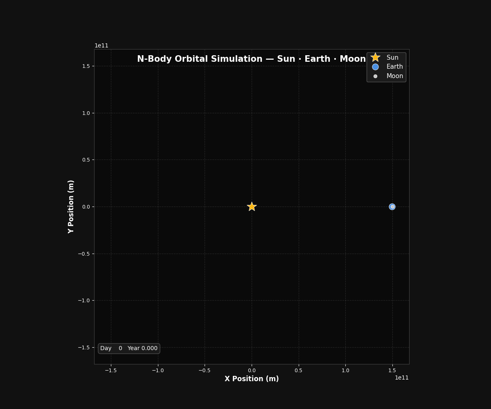
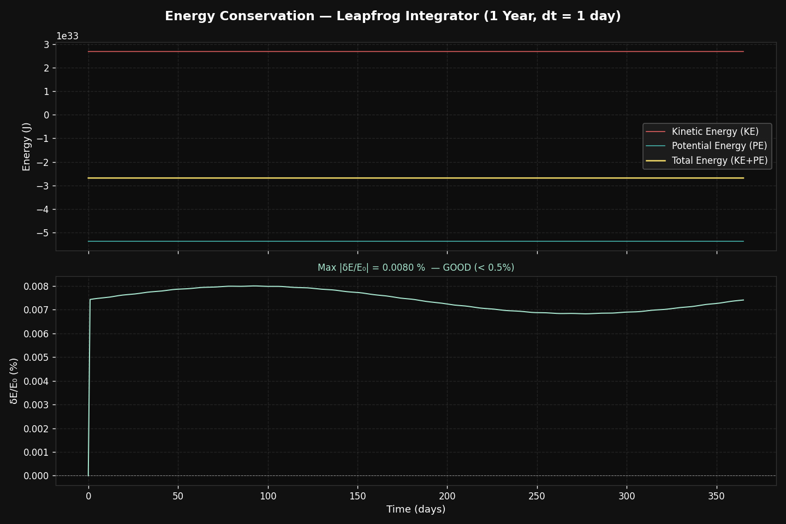

# NBody Simulation Engine

A modular and extensible N-Body gravitation simulation engine written in C++17, with Python visualizations.

This project simulates the gravitational interactions between N bodies over time using numerical integration methods. It produces trajectory states that can be visualized as animations and graphs.

---

## Features

* **C++ Core**: Built on C++17.
* **Modular Architecture**: Separation of concerns across core data structures, dynamics, integrators, and I/O logging.
* **Extensible Integrators**: Allows swapping numerical integration methods via polymorphism. Currently implements Forward Euler, with infrastructure to add other methods like Leapfrog or RK4.
* **Visualization Pipeline**: Includes a Python plotting script that parses the C++ output to generate animated GIFs of orbits and energy conservation graphs.
* **Testing**: Includes a CTest suite for vector operations, particle structures, and integrators.
* **CSV Logging**: Outputs trajectory and state data as CSV for integration with Pandas or other data processing tools.

---

## Architecture & Modularity

The project prioritizes modularity. New force calculations (such as electrostatic forces or custom potentials) or time integration schemes can be introduced without modifying the core data model.

```text
+------------------+         +-------------------------------+
|  Initialization  |         |        Visualization          |
|   (main.cpp)     |         |   (scripts/plot_orbits.py)    |
+--------+---------+         +---------------^---------------+
         |                                   | (Reads data/output.csv)
+--------v-----------------------------------+---------------+
|              N-Body Simulation Engine (C++)                |
|                                                            |
|  +-------------------+        +-------------------------+  |
|  |     Dynamics      |        |       Integrators       |  |
|  |    (Gravity.h)    |        | (TimeIntegrator.h API)  |  |
|  +---------+---------+        +------------+------------+  |
|            |                               |               |
|            v                               v               |
|  +-------------------+        +-------------------------+  |
|  |      Core         |        |         Utils           |  |
|  | (Vec3, Particle)  |<------>|  (Logger.h outputs CSV) |  |
|  +-------------------+        +-------------------------+  |
+------------------------------------------------------------+
```

### Modularity Benefits
* **Drop-in Replacements:** The `TimeIntegrator` base class allows defining new methods isolated in separate headers.
* **Decoupled Physics:** The `computeGravityForces` function operates on particles generically, meaning it can be replaced for different environmental simulations without affecting the integrator or logger.
* **Testability:** Localized units can be compiled and tested independently.

---

## Project Structure

```text
nbody-sim/
├── CMakeLists.txt              # CMake build configuration
├── data/                       # Simulation CSV outputs
├── scripts/
│   ├── plot_orbits.py          # Python script for visualizations
│   ├── orbit_animation.gif     # Output: Orbit Animation
│   └── energy_conservation.png # Output: Energy Graph
├── src/
│   ├── main.cpp                # Simulation entry point
│   ├── core/                   # Vec3 math and Particle structures
│   ├── dynamics/               # Force calculations (Gravity)
│   ├── integrators/            # Numerical integration schemes
│   └── utils/                  # I/O Loggers
└── tests/                      # Integrated CTest unit tests
```

---

## Getting Started

### Prerequisites
* **C++ Compiler** with C++17 support (GCC, Clang, or MSVC)
* **CMake** (3.10 or higher)
* **Python 3.x** with `matplotlib` and `pandas`
  ```bash
  pip install matplotlib pandas
  ```

### Build & Run Simulation

1. **Build the C++ Engine**
   ```bash
   mkdir build && cd build
   cmake ..
   cmake --build .
   ```

2. **Run the Simulation**
   ```bash
   ./nbody_sim
   ```
   This outputs `data/output.csv` containing the time-stepped simulation data.

3. **Run Tests**
   ```bash
   cd build
   ctest --output-on-failure
   ```

### Visualization

After running the simulation and generating the CSV output, run the Python script to visualize the orbits and physical quantities:
```bash
python scripts/plot_orbits.py
```
This processes the CSV data and generates the following files in the `scripts/` directory:
* `orbit_animation.gif` - An animated simulation of the interacting bodies.
* `energy_conservation.png` - An analysis of kinetic, potential, and total energy throughout the simulation runtime.

#### Visual Examples




---

## Contributing

To contribute new integrators or dynamic forces, inherit from `TimeIntegrator` for new numerical methods, or add a new force function in `src/dynamics/` and utilize it in `main.cpp`.
